class:  middle

.pull-left[

### Objectifs

<br>

- Contexte général de la gestion et du partage des données de recherche
- Acteurs impliqués
- Tendances actuelles
- Bonnes pratiques de base 
- Deux outils: 
  - Plan de gestion de données de recherche - *Portage*
  - Dépôts de données et autres outils - *Dataverse*
]

.pull-right[

```{r, out.width = "300px", echo = FALSE}
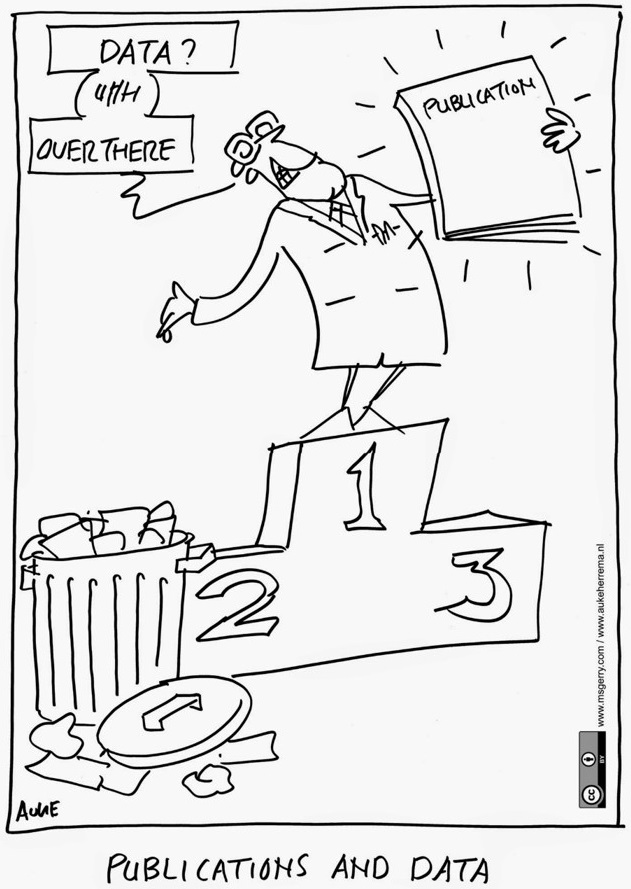
```

.verytiny[
https://www.elsevier.com/connect/open-science-needs-open-minds 
    ]]
.footer-note[[Image page titre](https://www.openaire.eu/blogs/research-data-management-rdm-support-at-the-university-of-vienna)]

---

### L'évolution du partage des données de recherche

```{r, echo = FALSE}
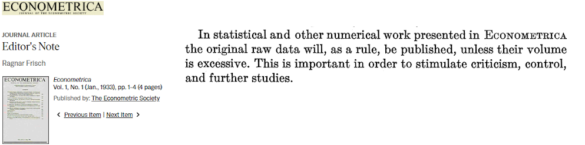
```


-  *[Standard Charts and Tables: Original Data](https://www.jstor.org/stable/1928764?origin=crossref&seq=18#metadata_info_tab_contents)*, 1919 - The Review of Economics and Statistics


- [Gary King, "Replication, Replication", *PS: Political Science & Politics*, 1995](https://www.cambridge.org/core/journals/ps-political-science-and-politics/article/replication-replication/85C204B396C5060963589BDC1A8E7357)   

"Political science is a community enterprise; the community of empirical political scientists needs access to the body of data necessary to replicate existing studies to understand, evaluate, and especially build on this work. Unfortunately, the norms we have in place now do not encourage, or in some cases even permit, this aim."

---

### L'évolution du partage des données de recherche


- Reconnaissance de la valeur des données -> Accès aux données devient enjeu social, économique et politique > Retour sur l’investissement gouv.
- Développement de nouvelles technologies et infrastructures permettant la diffusion et l’exploitation de gros volume de données.

```{r, echo = FALSE, fig.align= "center", out.width = "50px"}

```

- Mobilisation pour faire des données un produit de la recherche scientifique au même titre que les articles = partagées, citées,  créditées, réutilisées.
- Implication d’une multitude d’intervenants visant à développer des normes, standards, politiques, services et infrastructures favorisant le partage de données de recherche.

```{r, echo = FALSE, fig.align= "right", out.width = "155px"}

```

---

### Mobilisation des acteurs entourant les chercheurs

```{r, echo = FALSE, fig.align= "center"}
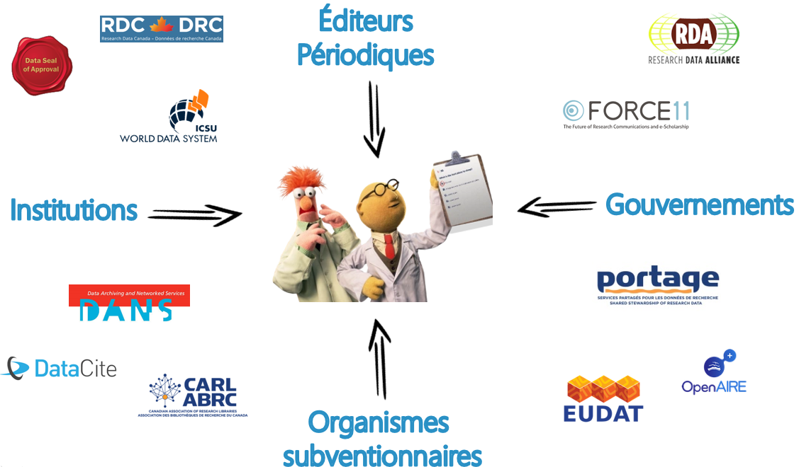
```

---

### Organismes gouvernementaux

#### Politiques et lignes directrices canadiennes (CRSH, IRSC, CRSNG):   
- Document de référence principal: [*Politique des trois organismes sur la gestion des données de recherche*](https://www.science.gc.ca/eic/site/063.nsf/fra/h_97610.html)

#### 3 volets :    

#### 1. Stratégie institutionnelle

.scriptsize[
> Chaque établissement qui administre des fonds des trois organismes doit créer une **stratégie institutionnelle de gestion des données de recherche**.
]

#### 2. Plans de gestion des données

.scriptsize[
> Toutes les demandes de subvention soumises aux organismes subventionnaires devraient inclure des méthodologies qui tiennent compte des meilleures pratiques en matière de gestion des données de recherche. Pour **certaines occasions de financement, les organismes subventionnaires demanderont que les plans de gestion des données soient soumis à l’organisme approprié au moment de la demande**, comme il est précisé dans l’appel de propositions. Dans ces cas, les plans de gestion des données seront examinés dans le processus de prise de décision..
]

---

### Organismes gouvernementaux


#### 3. Dépôt des données


.scriptsize[
> Les titulaires de subvention sont **tenus de déposer dans un dépôt numérique les données de recherche, les métadonnées et les codes qui appuient directement les conclusions de la recherche publiées** dans des revues de même que les préimpressions découlant de la recherche financée par les organismes subventionnaires.[...] 

> Le dépôt doit être effectué au **moment de la publication**. Le choix du dépôt peut être guidé par les attentes de la discipline et le jugement du destinataire, mais dans tous les cas, le dépôt doit assurer le stockage, la conservation et la curation sécuritaires des données. [...] 

> Les titulaires de subvention **ne sont pas tenus de partager leurs données**, mais les organismes subventionnaires s’attendent à ce que les chercheurs donnent un accès convenable aux données pour autant que les exigences éthiques, culturelles, juridiques et commerciales le permettent, et conformément aux principes FAIR et aux normes propres à leurs disciplines .
]

<br>

-> NB. Cette directive n'est toujours pas entrée en vigueur (pas pour demain!)

---

### Organismes gouvernementaux

#### Politiques et lignes directrices:  
- Autre document important: [*Énoncé de politique des trois conseils : Éthique de la recherche avec des êtres humains – EPTC 2 (2018)*](https://ethics.gc.ca/fra/documents/tcps2-2018-fr-interactive-final.pdf)   
  - [*Versement des données existantes dans des dépôts publics Lignes directrices sur l’application de l’EPTC 2*](https://ethics.gc.ca/fra/documents/guidance_depositing_data-fr.pdf)


.scriptsize[
> Les chercheurs peuvent verser des données précédemment recueillies dans un dépôt,
**dans la mesure où cela respecte les limites imposées par le consentement du participant**.
Lorsqu’il est pratiquement impossible d’obtenir le consentement des participants, les chercheurs
peuvent demander au Comité d’éthique de la recherche (CER) d’approuver une exception

> Si le dépôt des données pour une utilisation future à des fins de recherche n’a pas déjà été
mentionné dans le processus de consentement, et qu’on ne sait pas si les participants
accepteraient ou non d’être recontactés, **les chercheurs doivent les recontacter pour obtenir leur consentement au dépôt des données**.

> Si rien n’indique que les participants ont refusé l’utilisation future de leurs données et que les
chercheurs ne peuvent pas obtenir le consentement des participants parce que cela est
pratiquement impossible, **les chercheurs peuvent déposer les données sous réserve de
l’approbation du CER**.
]

---

### Initiatives institutionnelles de GDR au Canada/Québec

Les institutions américaines et britanniques ont développés des centres d’expertises, des programmes et des politiques plus contraignantes depuis plusieurs années déjà.

**Le Canada et le Québec se rattrapent rapidement**:

- Plusieurs groupes impliqués: [ABRC](https://www.carl-abrc.ca/fr/), [Données de Recherche Canada](https://www.rdc-drc.ca/fr/),  [Calcul Canada](https://www.computecanada.ca/?lang=fr)/[Calcul Québec](https://www.calculquebec.ca/), [Canarie](https://www.canarie.ca/rdm/), [NOIRN](https://www.engagedri.ca/), ...

- Plusieurs dépôts de données ont été développées ([Dataverse de Scholar’s Portal](https://dataverse.scholarsportal.info/), [FRDR](https://www.frdr-dfdr.ca/repo/), dépôts disciplinaires dont [CIOOS](https://catalogue.cioos.ca/)).
- Développement d'outils ([Assistant PGD](https://assistant.portagenetwork.ca/?locale=fr_CA)) et autres ressources de soutien (réseau [Portage](https://portagenetwork.ca/fr/))
-  À l'UdeM: groupe de travail BCI, Comité consultatif ( [BRDV](https://recherche.umontreal.ca/services-aux-chercheurs/de-lidee-a-la-valorisation/), [TI](https://ti.umontreal.ca/),  [CEN-R](https://recherche.umontreal.ca/services-aux-chercheurs/expertise-numerique/),  [BCRR](https://recherche.umontreal.ca/responsabilite-en-recherche/conduite-responsable/), [Direction des bibliothèques](https://bib.umontreal.ca/gerer-diffuser/gestion-donnees-recherche)) 
et lancement du [dépôt institutionnel Dataverse](https://dataverse.scholarsportal.info/fr/).

---

### Les éditeurs et périodiques

#### On reconnaît généralement quatre formes de partage de données de recherche:

```{r, out.width = "500px", echo = FALSE, fig.align= "center"}
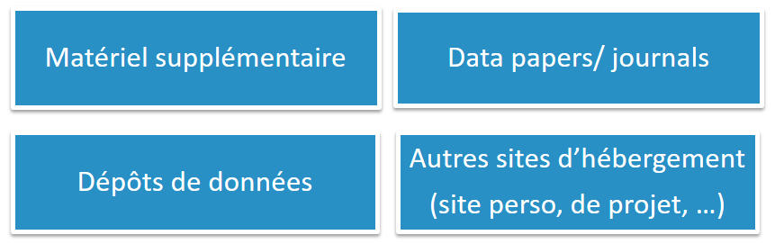
```

- Selon [Wiley](https://hub.wiley.com/community/exchanges/discover/blog/2014/11/03/how-and-why-researchers-share-data-and-why-they-dont?referrer=exchanges), le matériel supplémentaire à un article est la forme la plus commune de partage de données dans tous les domaines.
- Mais les éditeurs commencent à voir le matériel supplémentaire comme un poids difficile à gérer. Impose donc des limites de volume ou externalisent stockage des données > Ex: [Journal of Neuroscience](http://www.jneurosci.org/content/30/32/10599) (2010)
- Optent de plus en plus pour des partenariats avec des dépôts externes.
- Politiques et pratiques varient entre les éditeurs et entre périodiques d'un même éditeur vu les différences disciplinaires importantes 


---

### Les éditeurs et périodiques

.full-width[.small[.content-box-blue[*A condition of publication in a Nature journal is that authors are required to make materials, data, code, and associated protocols promptly available to readers without undue qualifications*. - [Nature](https://www.nature.com/nature-research/editorial-policies/reporting-standards)
]]]

.full-width[.small[.content-box-blue[*It is the policy of the American Economic Association to publish papers only if the data used in the analysis are clearly and precisely documented and are readily available to any researcher for purposes of replication. Data Availability Policy* - [American Economic Association](https://www.aeaweb.org/journals/data/data-code-policy)
]]]

.full-width[.small[.content-box-blue[*Will my manuscript be rejected if I do not submit data files? 
The Editors may choose to reject your manuscript if you are unwilling (rather than unable) to comply with the data sharing policy of the Journal in question* - [Wiley](https://authorservices.wiley.com/author-resources/Journal-Authors/open-access/data-sharing-citation/faqs.html)
]]]

.full-width[.small[.content-box-blue[*Is it compulsory to share my research data? No. Our policy is clear in that we encourage and support authors to share their research data rather than mandating them to do so [...] Where there is community support for (often discipline-specific) mandates regarding data deposit, submission and sharing, some of our journals may reflect this with their own mandatory data sharing policies* - [Elsevier](https://www.elsevier.com/about/policies/research-data/research-data-faqs)
]]]


---


### Les associations scientifiques


<br> 


.pull-left[.full-width[

*Gert Storms — who says he won’t step down — is one of a few hundred scientists who have vowed that, from the start of this year, they will begin rejecting papers if authors won’t publicly share the underlying data, or explain why they can’t*.*
]

]

.pull-right[
```{r, out.width = "300px", echo = FALSE}
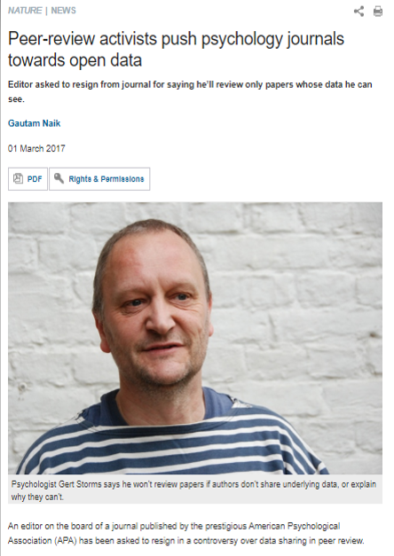
```
]

.footnote[[*][Peer Reviewers’ Openness Initiative
](https://opennessinitiative.org/the-initiative/)]

---

### Les associations scientifiques

    
- 2010 APSA approuvé la création d'un comité Ad hoc sur l'accès aux données et transparence en recherche (DA-RT)
- Mené a la révision de l'[APSA's Guide to Professional Ethics in Political Science](http://www.apsanet.org/portals/54/Files/Publications/APSAEthicsGuide2012.pdf)

.justify-right[
```{r, out.width = "100px", echo = FALSE}

```
    ]
    
- Janvier 2014 symposium DA-RT > [PS: Political Science & Politics](https://www.cambridge.org/core/journals/ps-political-science-and-politics/issue/journal-psc-volume-47-issue-1/CF30DAAFF46CE834E55ABEC5032703A9)

<br>

*Data Access and Research Transparency (DA-RT): A Joint Statement by Political Science Journal Editors*

.footnotesize[
> Transparency requires making visible both the empirical foundation and the logic of inquiry of research. We agree that by January 15, 2016 we will:
> **Require authors to ensure that cited data are available at the time of publication through a trusted digital repository. Journals may specify which trusted digital repository shall be used (for example if they have their own dataverse).** If cited data are restricted (e.g., classified, require confidentiality protections, were obtained under a non-disclosure agreement, or have inherent logistical constraints), authors must notify the editor at the time of submission. The editor shall have full discretion to follow their journal’s policy on restricted data, including declining to review the manuscript or granting an exemption with or without conditions. The editor shall inform the author of that decision prior to review.”
]
---

### Les associations scientifiques

[**Pétition de plus de 1000 membres de l’APSA**](https://dialogueondartdotorg.files.wordpress.com/2015/11/petition-from-concerned-scholars-nov-12-2015-complete.pdf)


.justify-right[
```{r, out.width = "100px", echo = FALSE}

```
    ]
    
- What norms, principles, or considerations should guide authors and reviewers in pursuing and judging analytic transparency for non-statistical forms of inquiry?
- What is the right balance between the costs and the benefits of rendering these types of data accessible? 
- Who should decide how to strike that balance in individual cases?
- Field notes or interview transcripts sometimes cannot be sufficiently “sanitized” without rendering their content un-interpretable. How can principles of data access be respected, and research transparency be achieved, while guaranteeing the protection of human subjects? 
- Will scholars conducting research on sensitive topics of central concern to our discipline be able to publish their work in journals that have endorsed DA-RT?
- Finally, many scholars have expressed the view that the decision about whether or not to make research materials publicly available should belong to scholars and not journal editors or reviewers. 

---

### Données de recherche > de quoi parle-t-on?

**Multitude de définitions - grande variation selon les disciplines en fonction de leurs objets de recherche**
> les données de la recherche sont définies comme des enregistrements factuels (chiffres, textes, images et sons), qui sont utilisés comme sources principales pour la recherche scientifique et sont généralement reconnus par la communauté scientifique comme nécessaires pour valider les résultats de la recherche. - [Principes et lignes directrices de l'OCDE pour l'accès aux données de la recherche financée sur fonds publics](http://www.oecd.org/fr/sti/inno/38500823.pdf)

<br>

**Bref, matériaux de base de la recherche**:
- De tous types: données expérimentales, observationelles, de simulation/code
- De toutes formes: images, vidéos, documents, …
- Et formats: pdf, xls, sav, shp, avi, dat, mp3, …
- Données primaires ou secondaires.

---


### Données de recherche > diffusion à géométrie variable

- L'ouverture des données de recherche: importante variation disciplinaire.
- Les sciences pures ont une plus grande tradition de partage, surtout via matériel supplémentaire ou dépôt disciplinaire > norme plutôt que l’exception. 
- Beaucoup moins de partage en sciences sociales ou informels entre collègues. Les chercheurs gèrent leurs données selon leurs propres besoins immédiats. 

**Mais longue histoire de partage aussi en sciences sociales** :

.pull-left[.full-width[
- Roper Public Opinion Research Center (1957). 
- Institute for Social Research (UMichigan)
- Inter-University Consortium for Political Research (ICPSR).  
- Michigan Election Studies > American National Election Studies.
]

]

.pull-right[
```{r, out.width = "200px", echo = FALSE}

```
]


.footer-note[[Image](http://www-03.ibm.com/ibm/history/exhibits/supplies/supplies_5404PH13.html )]

---

### Obstacles à la gestion et la diffusion

- Juridiques et éthiques: Protection des données personnelles (consentement, anonymisation), propriété industrielle, intellectuelle.
- Financiers: temps, ressources nécessaires.
- Technologiques/infrastructures.
- Culturels/professionnels.

**Réticences générales**: Sentiment de perte de temps, manque de volonté sans retombés réelles, inutilité de la démarche, absence de reconnaissance, peur de la mauvaise utilisation/interprétation,... 

.justify-right[
```{r, out.width = "300px", echo = FALSE}
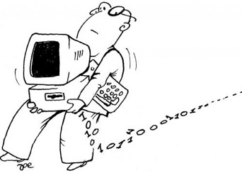
```
    ]


.footer-note[[Image](https://technofirmsoftware.wordpress.com/tag/data-loss-prevension/)]

---

### Bénéfices ?

- Permettre la réplication et la validation des résultats = transparence et intégrité.
- Meilleure exploitation des données par de nouvelles analyses.
- Réduire les coûts en évitant la duplication de recherches, la perte de données.
- Intensifier la collaboration et le progrès scientifique.
- Augmenter la visibilité et l’impact de la recherche > Citations.
- Respecter les politiques des organismes subventionnaires.
- Mais avant tout, c'est un investissement pour soi-même -> meilleure gestion = meilleure recherche!

[Reproducibility: It Is Just Good Science](https://www.ncbi.nlm.nih.gov/pubmed/27029767)

.justify-center[
```{r, out.width = "300px", echo = FALSE}
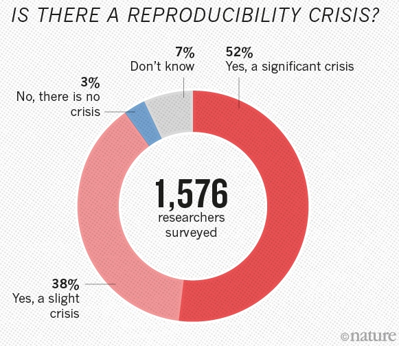
```
    ]
    
<br>

.footer-note[[Nature](nature.com/news/1-500-scientists-lift-the-lid-on-reproducibility-1.19970)]


--- 

### Obstacles à la gestion et la diffusion

- Juridiques et éthiques: Protection des données personnelles (consentement, anonymisation), propriété industrielle, intellectuelle.
- Financiers: temps, ressources nécessaires.
- Technologiques/infrastructures.
- Culturels/professionnels.

**Réticences générales**: Sentiment de perte de temps, manque de volonté sans retombés réelles, inutilité de la démarche, absence de reconnaissance, peur de la mauvaise utilisation/interprétation,... 

.justify-right[
```{r, out.width = "300px", echo = FALSE}

```
    ]

.footer-note[[Image](https://technofirmsoftware.wordpress.com/tag/data-loss-prevension/)]

---

### Pour surmonter les obstacles...

**Solutions se trouvent dans les pratiques et outils de gestion de données de recherche:**

- Utiliser des dépôts de données (disciplinaires ou généralistes).
- Associer un DOI pour permettre citation durable.
- Utiliser des Métadonnées disciplinaires détaillées (DDI).
- Attribuer une licence aux données.  
- Définir des conditions d’utilisation, restrictions d’accès, embargo...


Principes et pratiques [*FAIR*](https://www.openaire.eu/how-to-make-your-data-fair)

.justify-center[
```{r, out.width = "300px", echo = FALSE}
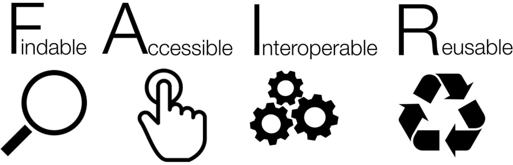
```
    ]

Principes et pratiques de la science ouverte: [Open Science Framework](https://osf.io/)

.justify-center[
```{r, out.width = "200px", echo = FALSE}

```
    ]

---

### Le cycle de vie des données de recherche
<br> 

.pull-left[.full-width[
- Ensemble d’activités qui traitent de  la collecte, l’organisation, la documentation, la préservation et la diffusion des données de recherche.

- Des standards et outils se développent pour faciliter chaque étape du processus, dont les plans de gestion de données de recherche.
]

]

.pull-right[
```{r, out.width = "450px", echo = FALSE}
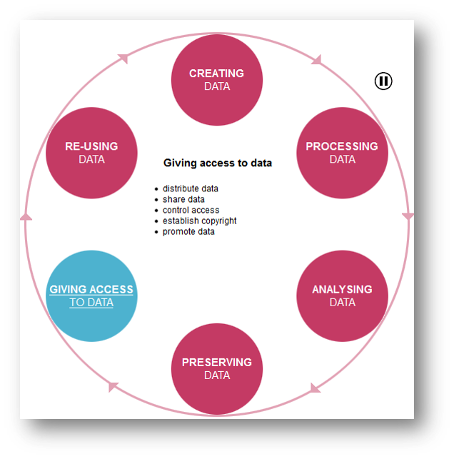
```
]


.footer-note[[UK Data Service](http://www.data-archive.ac.uk/create-manage/life-cycle)]

---

### Plan de gestion des données de recherche

- Court document (variable!) rédigé au début de la recherche (idéalement!) qui décrit les pratiques de gestion des données (production, traitement, documentation, conservation, diffusion) qui seront appliquées tout au long de la recherche, incluant le partage et la préservation à long terme.  
- Pas "seulement" une contrainte administrative -> **Outil de travail** pour développer de bonnes pratiques de gestion tout au long du processus de recherche, en tenant compte des particularités disciplinaires.  
- Se poser les bonnes questions dès le début du processus pour éviter les surprises et surcharge de travail à la fin. 
- Expliquer le *comment* et le *pourquoi*.
- Processus itératif de la recherche -> *Document vivant*.

<br> 

- [Exemples de PGD Portage complétés et autres ressources](https://portagenetwork.ca/fr/outils-et-ressources/ressources-de-formation-de-portage/)  
- [Public DMPs (DMPTool)](https://dmptool.org/public_plans)  
- [Natural Science Examples (ICPSR)](https://www.icpsr.umich.edu/icpsrweb/content/datamanagement/dmp/resources.html#a06)  
- [Example DMPs (DataOne)](https://www.dataone.org/data-management-planning)  
- [Example DMPs and guidance (Digital Curation Centre)](http://www.dcc.ac.uk/resources/data-management-plans/guidance-examples)

---
### Outils de gestion de données de recherche > 

.justify-right[
```{r, out.width = "200px", echo = FALSE}
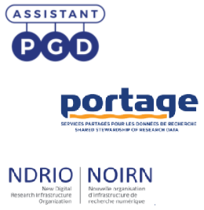
```
    ]

[**Assistant PGD**](https://assistant.portagenetwork.ca/)


Initiative de [**Portage**](https://portagenetwork.ca/fr/)


**Principaux objectifs** :
1. Création un réseau d’expertise:
  - Confidentialité, sécurité des données.
  - Gestion et préservation des données.
  - Exploration de données (data discovery).
  - Plans de gestion de données.
2. Création de services et d'une infrastructure de gestion des données de recherche.
2. Création d'une plateforme canadienne à partir de laquelle les données de recherche pourront être chargées, organisées, préservées, explorées, citées et partagées (collaboration avec Données de Recherche Canada, Compute Canada, l'association des bibliothèques de recherche du Canada):
[**DFDR: Dépôt fédéré de données de recherche**](https://demo.frdr-dfdr.ca/repo/?locale=fr)


    
---

class:  middle, center, background


### Assistant PGD

--

### 7 volets à considérer


---

### Collecte de données

.full-width[.content-box-blue[
- Quels types de données allez-vous recueillir, créer, lier, acquérir ou enregistrer? 
- Dans quels formats de fichier vos données seront-elles recueillies? Ces formats permettront-ils la réutilisation des données, le partage et l'accès à long terme aux données? 
- Quelles conventions et procédures utiliserez-vous pour structurer et nommer vos fichiers et en contrôler les versions afin de vous aider, ainsi que les utilisateurs potentiels, à mieux comprendre la façon dont vos données sont organisées? 

]]

.full-width[.content-box-border[
**Bonnes pratiques**
- Prioriser des formats répandus dans sa discipline et idéalement transférer en formats ouverts (ex: excel > CSV, word > txt/pdf, ...).
- Attention à la perte d’information ou de formatage.
- Créer en amont des conventions de nommage de fichiers, de classification des dossiers et répertoires de travail, d’identification des versions, ...
- Se familiariser avec les outils de nettoyage de données et de fichiers disponibles ([OpenRefine](http://openrefine.org/), [Bulk rename](https://www.bulkrenameutility.co.uk/),...).

]]
---

### Documentation et métadonnées


.full-width[.content-box-blue[
- Quels documents seront nécessaires pour que les données soient lues et interprétées correctement dans le futur? 
- Comment vous assurerez-vous de documenter le projet de façon systématique tout au long du processus? 
- Si vous utilisez une norme de métadonnées ou des outils pour documenter et décrire vos données, veuillez les indiquer ici. 
]]

.full-width[.content-box-border[
**Bonnes pratiques**
- Choisir une norme de métadonnées disciplinaires pour décrire ses données, pour en faciliter le repérage et la compréhension. Ex. DDI et autres [standards de métadonnées](http://rd-alliance.github.io/metadata-directory/standards/).
- Se familiariser avec les outils disponibles ([Nesstar publisher](http://www.nesstar.com/software/publisher.html), [Colectica](https://www.colectica.com/), [autres](https://www.ddialliance.org/resources/tools))
- Structurer et documenter adéquatement le contenu de ses fichiers de données (noms, valeurs de variables, valeurs manquantes, ...).
- Créer un dictionnaire de données et autres documents méthodologiques nécessaire à la **compréhension autonome** des données.
- Fichier *README*.

]]

---


### Stockage et sauvegarde


.full-width[.content-box-blue[
- Quelles sont les besoins de stockage anticipés pour votre projet en matière d'espace (en mégaoctets, gigaoctets, téraoctets, etc.) et de durée de stockage? 
- Comment vos données seront-elles stockées et sauvegardées pendant votre projet de recherche et à quel endroit le seront-elles? 
- Comment l'équipe de recherche et d'autres collaborateurs pourront-ils accéder aux données, modifier celles-ci ou en contribuer de nouvelles tout au long du projet? 

]]

.full-width[.content-box-border[
**Bonnes pratiques**
- Définir le nombre de copies, l’emplacement et la fréquence des sauvegardes.
*Règle 3-2-1*:
- 3 copies sur 2 formats (ex: disque dur externe + nuage) dont une à l’externe.

]]

---

### Conservation

.full-width[.content-box-blue[
- Où déposerez-vous vos données en vue de l'accès et de la préservation à long terme à la fin de votre projet de recherche? 
- Indiquez comment vous vous assurerez que vos données sont prêtes pour la conservation. À prendre en considération: formats de fichier appropriés pour la conservation mais qui préservent l'intégrité des données; anonymisation et dépersonnalisation des fichiers, y compris les fichiers de documentation. 

]]

.full-width[.content-box-border[
**Bonnes pratiques**
- Sélectionner son dépôt de données au préalable pour se conformer à ses exigences dès le départ.
- Consulter les politiques institutionnelles sur le [calendrier de conservation](http://archiv.umontreal.ca/service/regles_gestion/rdg_accueil.html).
- Consulter le [*Document de gestion des banques de données constituées ou utilisées pour des fins de recherche*](https://secretariatgeneral.umontreal.ca/public/secretariatgeneral/documents/Renseignements_personnels/Gestion0BDD.pdf) du Bureau de l’éthique.
- Vérifier les politiques de l’organisme subventionnaire et de l’éditeur.
- Identifier outils décisionnels utiles: [NERC Data Value Checklist](https://nerc.ukri.org/research/sites/data/policy/data-value-checklist/), [Research Data evaluation guide](https://www2.uwe.ac.uk/services/library/using_the_library/Services%20for%20researchers/Research%20Data%20Evaluation%20Guide.pdf), …

]]

---

### Partage et réutilisation

.full-width[.content-box-blue[
- Quelles données partagerez-vous et sous quelle forme? (p. ex. données brutes, traitées, analysées, définitives) 
- Avez-vous examiné quel type de licence d'utilisation inclure avec vos données? 
- Quelles mesures seront prises pour faire connaître l'existence de vos données au milieu de la recherche? 
]]

.full-width[.content-box-border[
**Bonnes pratiques**
- Déterminer quelles données doivent être partagées (*Replication data* ou +).
- Attribuer un [DOI](https://fr.wikipedia.org/wiki/Digital_Object_Identifier) pour augmenter la visibilité des jeux de données et en permettre la citation.
- Privilégier licence ouverte ([creative commons, avec ou sans attribution](https://creativecommons.org/licenses/?lang=fr)).
- Définir les permissions d’accès aux différents fichiers.
- Faire attention aux contraintes au partage: juridique, commerciale, industrielle, confidentialité.
- Attention aux **licences d’utilisation** des données secondaires (ex: Statistique Canada, OCDE, …).
]]

---

### Responsabilités et ressources


.full-width[.content-box-blue[
- Identifiez qui sera responsable de la gestion des données de ce projet pendant et après le projet ainsi que les principales tâches associées à ces responsabilités. 
- De quelle façon les responsabilités relatives à la gestion des données seront-elles gérées si des changements importants surviennent au sein du personnel qui supervise les données du projet, y compris un changement de chercheur principal? 
- De quelles ressources aurez-vous besoin pour mettre en œuvre votre plan de gestion des données? À combien évaluez-vous le coût total de la gestion des données? 
]]

.full-width[.content-box-border[

**Bonnes pratiques**
- Attribuer les rôles et responsabilités de chacun.
- Anticiper les coûts financiers > demande de subvention.
- Déterminer la propriété intellectuelle des données. Consulter les [politiques de l’UdeM](http://www.recherche.umontreal.ca/la-recherche-a-ludem/vice-rectorat/normes-et-integrite/probite-intelectuelle/) sur la gestion des bases de données et la probité intellectuelle.
]]
---

### Conformité aux lois et à l'éthique (1/3)

.full-width[.content-box-blue[
- Si votre projet comprend des données sensibles, comment vous assurerez-vous qu'il est géré de manière sécuritaire et que les données sont accessibles uniquement aux membres approuvés du projet? 
- Le cas échéant, quelles stratégies adopterez-vous pour traiter les utilisations secondaires des données sensibles? 
]]

.full-width[.content-box-border[

**Bonnes pratiques**
- Recherche auprès d’individus > formulaires de consentement obligatoires.
- Consulter le [Bureau de l’éthique de la recherche](http://www.recherche.umontreal.ca/ethique-de-la-recherche/ethique/) avec les êtres humains de l’UdeM.
- Se renseigner sur les lois relatives à la protection des renseignements personnels - [Commission d'accès à l'information du Québec](https://www.cai.gouv.qc.ca/chercheurs/informations-complementaires/)
- Utiliser des outils d’anonymisation – identifiants directs et indirects: [ARX Anonymisation  Tool](https://arx.deidentifier.org/), [Amnesia](https://amnesia.openaire.eu/), [packages R](https://cran.r-project.org/web/packages/sdcMicro/index.html).
- Utiliser un dépôt qui permet la restriction d'utilisation (embargo, accès sur demande...)

]]
---

### Conformité aux lois et à l'éthique (2/3)

#### La délicate question des données sensibles 

- Difficile d'avoir l'heure juste en matière de protection de la confidentialité 
- Différentes perspectives parfois contradictoires: approche normative (EPTC2 - politique fédérale d'éthique de la recherche) vs juridique (droit relatif à chaque pays ou province - surtout provincial)

.justify-right[
```{r, out.width = "100px", echo = FALSE}

```
    ]

**Que dit l'EPTC2?**

À la base **tous** les chercheurs qui oeuvrent au sein d'institutions qui gèrent des subventions des trois conseils doivent se soumettre aux règles de l'EPTC2, après s'appliquent les normes et lois provinciales, institutionnelles...


Pour des données (même anonymisées) receuillies dans le cadre d'une recherche faites auprès d'individus où le formulaire de consentement ne mentionnait pas explicitement le partage et la rediffusion:

- Il faut aller chercher le consentement auprès des participants (*re-consent*).
- Si c'est impossible, obligation d'aller chercher l'approbation du comité d'éthique en justifiant cette dérogation.

---

### Conformité aux lois et à l'éthique (3/3)

#### **Conclusions: **


- **Pas de consentement + pas d'approbation du CER = pas de dépôt**

Le CER a l'obligation de statuer, mais le "fardeau éthique" repose sur les épaules du chercheur (les décisions peuvent dépendre de différents facteurs dont la sensibilité , la vulnérabilité des participants...)

<br>

- **Nécessité de prévoir le partage des données dès le début du projet!**

<br>

-> [Outils pour les données sensibles du réseau Portage](https://portagenetwork.ca/fr/nouvelles/nouveaux-outils-pour-les-donnees-sensibles/) 


---

### Dépôts de données de recherche

#### Types de dépôts

.tiny[
|                  **Généralistes**       | **Institutionnels (académiques)**    | **Disciplinaires/spécialisés** |
  |-------------------------|---------------------|------------------|
  |[Zenodo](https://zenodo.org/)       |  [Purdue University Research Repository](https://purr.purdue.edu/)        | [ICPSR / OpenICPSR](https://www.icpsr.umich.edu/web/pages/deposit/index.html)     |
  | [Figshare](https://figshare.com/)             |  [Data repository for the University of Minnesota](https://conservancy.umn.edu/pages/drum/)       |  [Odum Institute Archive Dataverse](https://odum.unc.edu/archive/)       |
  | [Dataverse](https://dataverse.org/)          |  [Deep Blue Data (Michigan)](https://deepblue.lib.umich.edu/data)        |  [Roper Center](https://ropercenter.cornell.edu/)   |
  | [Dryad](https://datadryad.org/stash)            |  [Abacus Dataverse (CB)](https://abacus.library.ubc.ca/) |  [QDR – Qualitative Data repository](https://qdr.syr.edu/)      |
  | [Mendeley Data](https://data.mendeley.com/)         |  [Queen’s University (Dataverse)](https://dataverse.scholarsportal.info/dataverse/queens)          | [Cessda, Consortium of European Social Science Data Archives](https://www.cessda.eu/)     |
  | [OpenContext](https://opencontext.org/)            |  [Scholars Portal Dataverse](https://dataverse.scholarsportal.info/)       |  [ISPS Data Archive](https://isps.yale.edu/research/data/overview)       |
  | [UK Data Archive](https://www.data-archive.ac.uk/deposit/)         |  [Dash-DataOne](https://old.dataone.org/software-tools/dash)        |  [UCLA Social Science Data Archive](https://www.library.ucla.edu/social-science-data-archive/about-data-archive)     |
  | [B2Share (EUDAT)](https://b2share.eudat.eu/)            |    ...       |  [BeQuali](https://bequali.fr/fr/)       |
  | [Open Science Framework](https://osf.io/)          |            |  [HumaNum/Nakala ](https://www.huma-num.fr/services-et-outils/exposer)     |
  |              |           |  [Centre de données socio-politiques](https://cdsp.sciences-po.fr/fr/)    |
  
  ]
.footnotesize[
- Certains dépôts ont longue expérience d’archivage et de préservation, d’autres explorent encore.
- Certains dépôts sont gratuits, d’autres payants.
- Majorité des dépôts sont disciplinaires/domaines, surtout en sciences.
- Certains limitent les données selon format ou méthodologie: données d’enquêtes, essais cliniques...
- Dépôts disciplinaires spécialisés sont toujours recommandés car offrent souvent outils et services répondant aux exigences disciplinaires: métadonnées, restrictions pour données protégées...
- Répertoires de dépôts de données de recherche: http://www.re3data.org/  
- Voir aussi:  [Data Repositories (Open Access Directory)](http://oad.simmons.edu/oadwiki/Data_repositories), [NIH Data Repositories](https://www.nlm.nih.gov/NIHbmic/nih_data_sharing_repositories.html), [PLOS Recommended Repositories](https://journals.plos.org/plosone/s/recommended-repositories).
- Attention, les environnements de partage comme Github ou Google Drive ne sont pas considérés comme des dépôts
]
---

### Dataverse UdeM

https://dataverse.scholarsportal.info/dataverse/montreal 


Guide: [Déposer des données sur Dataverse](https://guides.bib.umontreal.ca/ckfinder/ckeditor_assets/attachments/guide_eclair_-_deposer_dans_spdv_20190911.pdf)

```{r, out.width = "700px", echo = FALSE, fig.align= "center"}
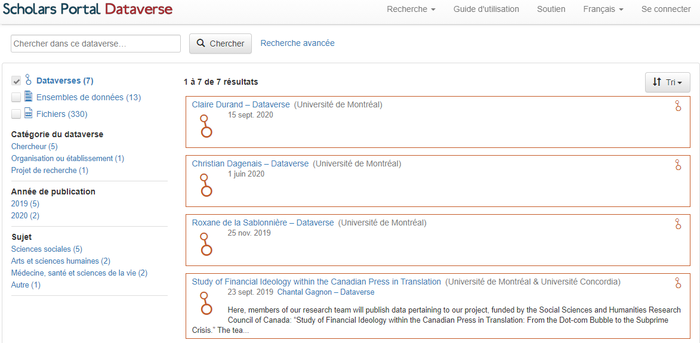
```
---
class: center, middle

# Merci!

## Questions?

<br>
Document créé avec le package R [**xaringan**](https://github.com/yihui/xaringan).

 <br>
 
caroline.patenaude@umontreal.ca 

 <br>
 
https://bib.umontreal.ca/guides/donnees-statistiques-geospatiales/donnees-statistiques
 
 <br>

https://github.com/CRLNP


---
class: center, bottom

# Pour aller plus loin

--

[Portage](https://portagenetwork.ca/fr/outils-et-ressources/ressources-de-formation-de-portage/)

--

[Guide to Social Science Data Preparation and Archiving](https://www.icpsr.umich.edu/web/pages/deposit/guide/)

--


[Guide GDR Bibliothèques UdeM](https://bib.umontreal.ca/gerer-diffuser/gestion-donnees-recherche)

--

[Dépôt Dataverse UdeM](https://dataverse.scholarsportal.info/dataverse/montreal)


--

.

--

.

--

.

--

FIN
